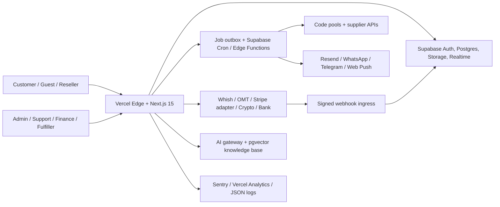
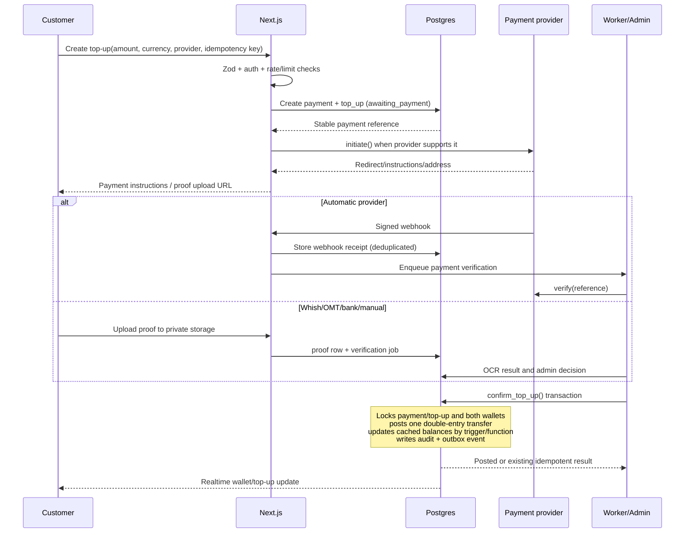

# Nexora Platform Architecture

Status: Phase 0 architecture baseline
Last reviewed: 2026-08-04
Normative inputs: the Master Spec and `DATABASE.md`

## 1. Architectural goals

Nexora is a multi-tenant-in-capability, single-marketplace platform for digital goods and digital services. The architecture optimizes for four properties:

1. **Money correctness:** transfers are atomic, idempotent, double-entry, append-only, and reconcilable.
2. **Fulfillment reliability:** automatic delivery is asynchronous, retryable, observable, and always able to fall back to a staffed queue.
3. **Locale independence:** application routes, content, money, time, notifications, search, and admin authoring all treat locale as data.
4. **Incremental delivery:** each feature is a vertical slice with clear ports, schemas, authorization, events, and tests; Phase 0 does not prematurely implement the whole product.

## 2. System context



### Deployable units

| Unit                 | Runtime                        | Responsibility                                                                 | Trust level                    |
| -------------------- | ------------------------------ | ------------------------------------------------------------------------------ | ------------------------------ |
| Storefront and admin | Vercel Next.js                 | RSC pages, route handlers, Server Actions, SEO, BFF composition                | User/session scoped            |
| Primary data plane   | Supabase Postgres              | Durable state, RLS, constraints, money functions, transition functions, outbox | Source of truth                |
| Identity and files   | Supabase Auth/Storage          | Auth methods, sessions, private uploads, signed delivery URLs                  | RLS/storage-policy scoped      |
| Realtime             | Supabase Realtime              | Order events, chat, notifications, staff queue updates                         | Subscription policies scoped   |
| Async workers        | Supabase Edge Functions + Cron | fulfillment, notification fan-out, reconciliation, FX, retries                 | Service role; narrow functions |
| Rate limit           | Upstash Redis                  | sliding-window limits and reseller API quotas                                  | Server only                    |
| Observability        | Sentry + Vercel                | errors, traces, web vitals; logs are PII-redacted                              | Server/public SDK split        |

## 3. Codebase module map

```text
src/
├── app/
│   ├── [locale]/                 # locale-prefixed route tree; RSC by default
│   │   ├── (storefront)/         # catalog, product, cart, checkout, orders
│   │   ├── (account)/            # wallet, loyalty, affiliate, support, KYC
│   │   ├── admin/                # permission-gated operations workspace
│   │   ├── reseller/             # reseller portal
│   │   └── design-system/        # living token/component/state guide
│   └── api/
│       ├── v1/                   # public reseller API
│       ├── webhooks/             # payment, supplier, notification callbacks
│       └── internal/             # signed worker callbacks
├── features/
│   ├── auth/                     # profiles, sessions, 2FA, KYC
│   ├── catalog/                  # categories, products, variants/options, search
│   ├── pricing/                  # price engine, FX, coupons, promotions, tax
│   ├── cart/                     # guest/auth carts, bundles, upsells
│   ├── checkout/                 # checkout orchestration and snapshots
│   ├── payments/                 # provider port, adapters, proof workflow
│   ├── wallet/                   # ledger commands, holds, reconciliation
│   ├── orders/                   # state machine, timelines, invoices
│   ├── fulfillment/              # inventory, drivers, manual queue, delivery
│   ├── affiliates/               # attribution, commissions, payouts, fraud
│   ├── resellers/                # wholesale tiers, API keys, HMAC, webhooks
│   ├── loyalty/                  # points ledger, tiers, streaks, badges
│   ├── ai/                       # RAG, recommendations, OCR, risk, translation
│   ├── notifications/            # preferences, templates, channel delivery
│   ├── support/                  # tickets, order chat, disputes, KB
│   ├── reviews/                  # verified reviews and moderation
│   ├── marketing/                # CMS, blog, pixels, UTM, recovery
│   ├── admin/                    # RBAC, dashboards, flags, imports, audit
│   ├── preferences/              # locale, currency, theme (UI state only)
│   └── storefront/               # homepage composition and discovery UI
├── components/ui/                # token-only shadcn primitives
├── db/                           # Drizzle schema and database access modules
├── i18n/                         # locale routing/navigation/request config
├── lib/
│   ├── auth/                     # server guards and permission checks
│   ├── events/                   # domain-event/outbox contracts
│   ├── logging/                  # PII-safe structured logging
│   ├── money/                    # integer amount and currency utilities
│   ├── security/                 # CSRF, encryption, signing, sanitization
│   ├── supabase/                 # browser/server/admin clients
│   └── validation/               # reusable Zod schemas
└── instrumentation.ts            # Sentry and runtime instrumentation
```

Every feature follows `components`, `server`, `schemas`, and `hooks`. A feature can import `src/lib` and `src/components/ui`; cross-feature writes go through a public server command or domain event, never directly into another feature's tables.

## 4. Request architecture

### Read path

1. Middleware validates/detects locale and maintains a locale-prefixed URL.
2. A React Server Component reads the Supabase session and performs server-side authorization.
3. Drizzle executes typed, parameterized queries through the server connection where appropriate; user-scoped Supabase reads remain subject to RLS.
4. The server maps database records to explicit view models, resolves JSONB translations using `requested -> default -> first available`, and formats no money until the view boundary.
5. Client components receive serializable minimum data. TanStack Query owns interactive remote state; Zustand owns only local UI preferences such as currency and drawer state.

### Mutation path

1. Client submits a Server Action or route handler request with a CSRF token where cookies authorize the request.
2. Zod parses the complete input; unknown fields are rejected.
3. An explicit guard checks session, role/permission, account status, limits, and resource ownership. RLS remains defense in depth.
4. The mutation calls a transaction-safe database command. Money and order-state changes use security-definer functions with fixed `search_path`, locked rows, and restricted grants.
5. The same database transaction records the audit entry and inserts a domain event into `event_outbox`.
6. The response contains an operation ID and current snapshot. TanStack Query applies or reconciles optimistic state.
7. Workers claim outbox jobs with `FOR UPDATE SKIP LOCKED`, execute idempotently, and write attempts/dead letters.

### Data ownership rule

Postgres is authoritative for identity-linked application state, pricing snapshots, money, order status, inventory assignment, fulfillment, rewards, attribution, and audit history. Redis is never authoritative. Realtime is transport, not storage. Provider responses are evidence, not state, until verified and persisted.

## 5. Wallet top-up flow



#### Invariants

- Client-supplied provider status is ignored.
- The provider event ID and the business idempotency key are independently unique.
- Proof files live in a private bucket; customers can read their own proof, finance roles can review, and public URLs never exist.
- Verification credits from a platform cash clearing wallet to the customer's wallet. The ledger amount and currency must match both wallet accounts.
- A top-up cannot be confirmed twice. Provider over/under-payment becomes a finance exception, not an automatic balance mutation.
- Manual rejection requires a reason and audit event. Refunds are compensating ledger rows, never updates.

## 6. Auto-fulfilled wallet purchase flow

```mermaid
sequenceDiagram
  participant U as Customer
  participant N as Next.js
  participant DB as Postgres
  participant F as Fulfillment worker
  participant S as Inventory/Supplier
  participant C as Notification worker

  U->>N: Checkout(cart, wallet, idempotency key)
  N->>N: Validate options, quote expiry, auth/guest rules
  N->>DB: create_paid_order_with_wallet()
  Note over DB: Reprice server-side, snapshot all amounts<br/>lock wallet, debit atomically, create order/items<br/>transition paid -> processing, emit event
  DB-->>N: Order number and processing state
  N-->>U: Processing timeline
  DB->>F: Outbox event claimed
  F->>DB: Claim fulfillment attempt
  alt Code inventory
    F->>DB: Atomic unassigned code claim (SKIP LOCKED)
    DB-->>F: Encrypted code assignment
  else Supplier API
    F->>S: placeOrder() with stable external key
    S-->>F: Supplier reference/status
    F->>S: checkStatus() until terminal
  end
  alt Fulfilled
    F->>DB: Store encrypted delivery + transition delivered
    DB-->>U: Realtime timeline update
    DB->>C: delivery notification event
  else Auto failure and auto_then_manual
    F->>DB: Open manual task with SLA + transition on_hold/processing
  else Terminal auto failure
    F->>DB: Mark failed; release/refund via compensating transfer policy
  end
```

#### Purchase transaction boundary

The checkout database function locks the active quote, cart, wallet, and relevant inventory reservation rows; recalculates pricing; rejects stale/invalid quotes; inserts immutable snapshots; posts the wallet transfer; creates the initial order status history; and writes the outbox event. No supplier call occurs inside this transaction.

#### Fulfillment controls

- A fulfillment attempt has a unique `(order_item_id, attempt_number)` and a stable supplier idempotency key.
- The driver interface is `placeOrder`, `checkStatus`, `getBalance`, `cancel`; adapters return normalized statuses and never write orders.
- Circuit state is stored per supplier. Retry delays use capped exponential backoff with jitter. Exhausted jobs move to `fulfillment_dead_letters` and alert operations.
- Code inventory uses row locking and a partial unique index so a code is assigned once. Code plaintext is encrypted; only authorized delivery paths decrypt it.
- `auto_then_manual` creates one manual task only, preserving all failed-attempt context.

## 7. Core ports

```ts
interface PaymentProvider {
  initiate(input: InitiatePayment): Promise<PaymentInstructions>;
  verify(reference: ProviderReference): Promise<VerifiedPayment>;
  handleWebhook(request: SignedWebhookRequest): Promise<NormalizedPaymentEvent>;
  refund(input: RefundPayment): Promise<RefundResult>;
  getStatus(reference: ProviderReference): Promise<PaymentStatus>;
  capabilities: ReadonlySet<PaymentCapability>;
}

interface SupplierDriver {
  placeOrder(input: SupplierOrder): Promise<SupplierOrderResult>;
  checkStatus(reference: string): Promise<SupplierOrderStatus>;
  getBalance(): Promise<SupplierBalance>;
}
```

Adapters are resolved by provider code and versioned configuration. Provider-specific payloads are encrypted JSON evidence; business logic consumes only normalized results.

Phase 4 implements this port in `src/features/payments/server/providers`. A card
driver alias is selected with `CARD_PAYMENT_PROVIDER`; operational availability,
limits, basis-point/fixed fees, markets, tiers, instructions and sandbox mode are
stored in `payment_methods`. `settle_wallet_topup()` is the only payment-to-ledger
boundary: it locks the payment, posts the Phase 3 double-entry credit and fee, and
stores the resulting wallet transaction in one idempotent database transaction.

## 8. Order state machine

Allowed transitions are centralized in a Postgres function and mirrored in TypeScript for UI affordances. The database function is authoritative.

```text
draft -> awaiting_payment -> paid -> processing -> partially_delivered -> delivered -> completed
   |            |             |         |                  |              |
   +-> cancelled+-> cancelled +-> refunded/on_hold         +-> disputed <-+
                              +-> processing/failed/on_hold/cancelled
on_hold -> awaiting_payment | paid | processing | cancelled | refunded
failed -> processing | refunded | cancelled
disputed -> completed | refunded
```

Every transition records actor, source, reason, public/private note, previous/new state, and timestamp. Illegal transitions raise at the database boundary.

## 9. Pricing and money

- Amounts are signed `bigint` minor units plus ISO currency code. Application money types are branded integers; arithmetic rejects `number` fractions.
- USD is the base price. A quote stores the exact FX rate record, rounding rule, country/tier rules, discounts, tax, and totals used.
- FX rates use fixed-precision `numeric(24,12)` because rates are ratios, not money. Converted outputs return to integer minor units before persistence.
- Orders and invoice lines never recalculate historical amounts from current products or FX.
- Wallets do not exchange currencies implicitly. An explicit FX transfer will use clearing accounts and two linked ledger transfers in a later phase.

Phase 5 implements the pricing pipeline as a pure integer function used only by
the server pricing service. Checkout persists the complete result on both the
order and each item, then performs a final stock check before selecting one of
two money boundaries: `pay_order_with_wallet()` or `settle_order_payment()`.
Checkout idempotency is unique per profile/guest and cart, so browser retries
return the original order and can never create a second debit.

Guest carts are identified by a random cookie whose digest is stored in the
database. On authentication, the callback merges lines by variant and stable
option fingerprint. Guest orders use a separate order-scoped HttpOnly cookie;
server routes verify its digest before returning orders, deliveries, or PDFs.

## 10. Authorization and RLS

Authorization has three layers:

1. **Route/server guard:** authenticate, load account status, and demand explicit permissions (`catalog.write`, `orders.fulfill`, `finance.approve`, etc.).
2. **Database RLS:** user ownership, staff permission membership, and safe public visibility. Service-role workers are limited to audited entry functions.
3. **Database invariant:** constraints, triggers, functions, and restricted grants prevent invalid money/state changes even if a guard is defective.

No table is left with RLS disabled. Tables intentionally unavailable to clients have RLS enabled and no client policy (service-role only). Storage buckets have equivalent object policies. Admin roles are application roles, never Postgres superusers.

## 11. Async jobs and events

`event_outbox` is written with the business transaction. A scheduled Edge Function atomically claims due records. `job_attempts` records starts, completion, normalized error category, latency, and provider correlation IDs. Job handlers are idempotent. Recurring jobs include:

- payment verification and proof OCR;
- supplier placement/status polling and inventory alerts;
- notification fan-out and retries;
- FX refresh and admin-override expiry;
- nightly wallet reconciliation and mismatch alerts;
- loyalty expiry/tier calculation, streaks, and reseller tier upgrades;
- abandoned-cart messaging, affiliate fraud review, webhook delivery;
- search/recommendation refresh and knowledge embeddings;
- data retention, GDPR export/deletion, and signed-file cleanup.

## 12. Realtime model

Clients subscribe only to narrow projections: `order_status_events`, `order_deliveries`, `chat_messages`, `user_notifications`, and wallet transaction inserts. RLS controls subscriptions. The client refetches the authoritative snapshot after an event; event payloads are not trusted as the full record. Presence/broadcast is limited to typing indicators and ephemeral admin collaboration.

## 13. Localization and content

- All customer routes are prefixed (`/ar`, `/en`). Adding a locale requires one JSON message file and an enabled `locales` row; a build-time locale loader will read supported locale files automatically by Phase 1.
- Database translations use `jsonb` objects and a shared resolver. A check requires object shape; authoring validation enforces enabled locale keys.
- CSS uses logical properties and Lucide directional icons receive an RTL transform.
- Latin uses Geist; Arabic uses IBM Plex Sans Arabic via `next/font`, so Arabic never reaches a default system face.
- `Intl.NumberFormat`, `Intl.DateTimeFormat`, and `Intl.RelativeTimeFormat` own presentation formatting.

## 14. Security model

- CSP is nonce-based in production; third-party sources are allowlisted per enabled integration. Security headers are set at the Next boundary.
- Cookie mutations require origin validation and CSRF tokens. OAuth callbacks use state/PKCE.
- Auth/payment/reseller endpoints have account/IP/device limits and Turnstile escalation.
- Webhooks use raw-body signature verification, timestamp tolerance, replay storage, then asynchronous processing.
- Sensitive delivery codes, provider secrets, government IDs, TOTP seeds, and payment evidence are encrypted or isolated in private storage.
- Logs use request/correlation IDs and hashes, never proof images, tokens, full phone/email, delivery codes, or payment payloads.
- GDPR workflows preserve legally required finance/audit records while pseudonymizing customer PII.

## 15. Observability and SLOs

All server logs are structured JSON with `timestamp`, `level`, `service`, `environment`, `request_id`, `trace_id`, `actor_id_hash`, `operation`, `result`, `duration_ms`, and safe context. Initial service objectives:

| Journey                       | SLO                                             |
| ----------------------------- | ----------------------------------------------- |
| Storefront availability       | 99.9% monthly                                   |
| Wallet posting correctness    | 100%; reconciliation mismatch is a P0           |
| Checkout API latency          | p95 < 800 ms excluding hosted provider redirect |
| Auto fulfillment start        | p95 < 30 seconds after paid                     |
| Realtime timeline propagation | p95 < 3 seconds                                 |
| Manual queue acknowledgement  | tier/product SLA, alerted before breach         |

Sentry captures releases, source maps, traces, and sanitized errors. Operational dashboards combine business metrics with provider latency/error rate, circuit state, wallet reconciliation, queue age, SLA risk, and notification delivery.

## 16. Key decisions and rationale

| Decision                           | Rationale                                                                                                                | Consequence                                                                                         |
| ---------------------------------- | ------------------------------------------------------------------------------------------------------------------------ | --------------------------------------------------------------------------------------------------- |
| Modular monolith first             | Transactions span cart, money, order, and fulfillment orchestration; one deployable keeps correctness and velocity high. | Feature boundaries and ports must be enforced in code review so future extraction remains possible. |
| Postgres functions for money/state | Row locks, idempotency, constraints, ledger entry, history, and outbox must be atomic.                                   | Trusted commands are migration-reviewed and callable only through restricted grants.                |
| Transfer-row double entry          | Each immutable transaction names debit and credit wallets, balancing by construction.                                    | Platform clearing/revenue/liability wallets must exist per currency.                                |
| Transactional outbox               | Avoids paid-but-not-fulfilled gaps between database commit and queue publication.                                        | Workers poll/claim Postgres; retention and dead-letter jobs are required.                           |
| Snapshot orders and quotes         | Catalog, tax, exchange, and discounts change; orders must remain reproducible.                                           | Some intentional denormalization is accepted for auditability.                                      |
| JSONB translations                 | Adding locales does not require columns or code-path changes.                                                            | Validation, fallback, and search-vector refresh are centralized.                                    |
| Adapter ports for providers        | Local payment/supplier availability changes frequently.                                                                  | Provider configuration and capabilities are data; normalized contracts are tested.                  |
| RSC by default                     | Minimizes client secrets/JavaScript and keeps authorization close to data.                                               | Interactive islands use TanStack Query; Zustand remains UI-only.                                    |
| Supabase cron/Edge queue           | Meets the required stack and avoids operating Redis job infrastructure.                                                  | BullMQ semantics are implemented through job/outbox tables and `SKIP LOCKED`.                       |
| Private object storage             | Proofs, KYC, chats, and deliverables contain sensitive data.                                                             | Access always uses short-lived signed URLs and storage policies.                                    |

## 17. Local and delivery topology

- `docker compose up -d` starts pgvector-enabled Postgres on port `54322` for migrations and domain tests.
- Supabase CLI will become the full local Auth/Storage/Realtime runtime in Phase 1; the Compose database remains useful for isolated CI/domain testing.
- Vercel preview deployments use separate Supabase branches/projects and sandbox provider credentials.
- Production migrations run as a gated release step before traffic promotion. Destructive migrations use expand/migrate/contract releases.

## 18. Architecture fitness checks

CI will progressively enforce: strict TypeScript and no `any`; import boundaries; migration/RLS lint (every public table has RLS and at least intended access posture); no float money columns; timestamp/ID conventions; Zod on mutation inputs; provider contract tests; state-machine tests; ledger property tests; RTL/LTR visual tests; accessibility checks; and critical Playwright journeys.

## 20. Phase 11 AI and PWA boundary

AI runs behind a provider-neutral server boundary and is never part of a financial or order-state transaction. Public approved content is embedded in pgvector; authenticated order context is fetched separately through the requesting user's RLS-scoped Supabase client and is never written to the shared vector corpus. Retrieved content is treated as untrusted data. The assistant can answer or open a support ticket, but cannot approve payments or mutate wallets.

The AI worker uses the same Postgres queue semantics as fulfillment: idempotent keys, `SKIP LOCKED` leases, exponential retry, and dead-letter visibility. Recommendation, risk, OCR, translation, and aggregate-insight tasks share observability and configured cost accounting while retaining deterministic fallbacks. `AI_PROVIDER=disabled` is a supported production mode.

The service worker is an untrusted client cache. It may cache public catalog responses and queue only explicitly allowlisted, non-money mutations. Checkout, wallet, payment, reseller order, and admin requests are never background-replayed by the service worker. All replayed requests still pass normal authentication, Zod validation, authorization, and server idempotency.

## 19. Phase 7 administration boundary

`/{locale}/admin` is a trusted server-rendered boundary. The layout requires `admin.access`; each page and route handler then requires a domain permission. A static resource registry allowlists tables, visible columns, editable fields, validation types, and supported operations. The server uses trusted credentials only after authorization and never sends those credentials to client components.

Generic administration deliberately excludes invariant-changing writes for orders, payments, wallets, and stock codes. Those resources remain readable/exportable through the console but mutate only through their Phase 3–6 command functions and queues. All accepted generic writes create an append-only audit event with actor, request metadata, and before/after snapshots.

Business-intelligence queries aggregate the authoritative operational tables at request time and convert reporting values through configured integer exchange rates. The homepage builder stores localized, scheduled sections as JSONB; the public homepage reads only rows allowed by its published-content RLS policy and caches them for one minute.

# Phase 12 launch-hardening addendum

Phase 12 adds a cross-cutting trust boundary in middleware before locale or business routing. Unsafe browser API requests must pass same-origin/Fetch Metadata CSRF checks and endpoint-class rate limits. Cron, payment/notification webhooks, and reseller/SMM endpoints bypass browser-origin checks only because they use bearer/HMAC/provider signatures and replay protection. Upstash is the distributed production counter; memory is a local fallback.

Every response receives CSP/HSTS/frame/referrer/permissions protections. Next.js receives a per-request nonce, while payment and Turnstile frames and Supabase/Sentry/Upstash connections are explicitly allowlisted. The Sentry client/server/edge setup sends no default PII and strips request bodies, cookies, and authorization data. Structured application logs redact identity and credential-shaped keys.

The privacy boundary consists of consent history, authenticated JSON export, delayed deletion requests, and a nightly service-role retention function. Financial ledger, audit, dispute, and statutory records are preserved/pseudonymized rather than mutated. Private delivery, support, review, and payment files continue to use scoped, short-lived signed URLs.

CI now treats security as code: migration scanning requires RLS plus policy intent for every table, live audits query `pg_class`/`pg_policy` when a staging URL is supplied, mutation routes require an authorization/signature marker, client bundles are scanned for suspicious secrets, and performance budgets run after build. `/api/health` is safe for external uptime monitors and exposes only coarse dependency status/version/region.
