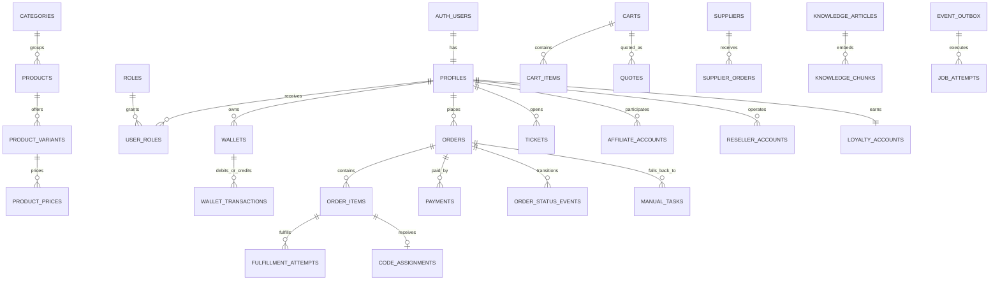

# Nexora Postgres Data Model

Status: target schema specification; Phase 0 executes the foundation subset in `drizzle/0000_platform_foundation.sql`. Later phases add the remaining tables through checked-in Drizzle migrations. This document is normative for those migrations.

## 1. Global conventions

### Required columns

Every application table below includes these columns even when the per-table entry uses the shorthand **[core]**:

| Column       | Type          | Rules                                                             |
| ------------ | ------------- | ----------------------------------------------------------------- |
| `id`         | `uuid`        | PK, `default gen_random_uuid()`                                   |
| `created_at` | `timestamptz` | not null, `default now()`, UTC                                    |
| `updated_at` | `timestamptz` | not null, `default now()`, maintained by `set_updated_at` trigger |

Tables marked **[soft]** additionally contain `deleted_at timestamptz null`; normal queries and public policies require `deleted_at is null`. Append-only/history/event tables still include `updated_at` for the platform convention, but reject update/delete and retain its original value.

### Data rules

- Monetary values are `bigint` integer minor units and always have a same-row ISO `currency_code text` FK. Ratios, percentages, tax rates, and exchange rates use fixed precision `numeric`, never floating point.
- Translated content is `jsonb` shaped as `{localeCode: string}`. `is_translation_object()` validates object/string values. Required content must contain the default locale.
- Timestamps are `timestamptz`. Calendar-only values are `date`; SLA/duration values are integer seconds.
- Country, currency, locale, state, and provider identifiers are codes, not translated labels.
- Sensitive JSON/text is suffixed `_encrypted`; ciphertext includes key version. Searchable sensitive values use a separate blind hash.
- Polymorphic references use `(reference_type, reference_id)` and are never used for ownership authorization without a typed parent.
- Foreign keys default to `ON DELETE RESTRICT`. Explicit CASCADE/SET NULL behavior is stated below.
- Every public-schema table has `ENABLE ROW LEVEL SECURITY` and `FORCE ROW LEVEL SECURITY` in production. “Service only” means RLS is on with no anon/authenticated policy.

### Standard indexes

Every table has its PK index. Every FK receives a btree index unless it is the leading column of a listed unique/composite index. Soft-delete entities receive a partial active index for their primary lookup. High-volume event/ledger tables use `(parent_id, created_at desc)` indexes and monthly partitioning when volume warrants it.

## 2. Enums

| Enum                        | Values                                                                                                                                                       |
| --------------------------- | ------------------------------------------------------------------------------------------------------------------------------------------------------------ |
| `text_direction`            | `ltr`, `rtl`                                                                                                                                                 |
| `staff_role_code`           | roles are rows, not enum; seed codes: `owner`, `admin`, `support`, `fulfiller`, `finance`, `read_only`                                                       |
| `kyc_status`                | `not_required`, `pending`, `in_review`, `needs_info`, `approved`, `rejected`, `expired`                                                                      |
| `review_state`              | `draft`, `pending`, `approved`, `rejected`, `archived`                                                                                                       |
| `product_kind`              | `game_topup`, `subscription`, `gift_card`, `smm`, `digital_service`                                                                                          |
| `product_state`             | `draft`, `active`, `out_of_stock`, `coming_soon`, `paused`, `archived`                                                                                       |
| `fulfillment_mode`          | `auto`, `manual`, `auto_then_manual`                                                                                                                         |
| `option_input_type`         | `text`, `textarea`, `number`, `url`, `email`, `select`, `radio`, `checkbox`, `file`, `player_id`                                                             |
| `price_rule_type`           | `margin`, `country`, `customer_tier`, `reseller_tier`, `quantity`, `schedule`, `first_order`                                                                 |
| `discount_type`             | `percent`, `fixed`, `free_item`                                                                                                                              |
| `cart_status`               | `active`, `converted`, `abandoned`, `expired`                                                                                                                |
| `quote_status`              | `active`, `accepted`, `expired`, `invalidated`                                                                                                               |
| `payment_method`            | `wallet`, `whish`, `omt`, `card`, `crypto`, `bank_transfer`, `cash`                                                                                          |
| `payment_status`            | `created`, `requires_action`, `awaiting_proof`, `pending`, `under_review`, `succeeded`, `failed`, `cancelled`, `partially_refunded`, `refunded`, `expired`   |
| `proof_status`              | `uploaded`, `scanning`, `needs_review`, `approved`, `rejected`                                                                                               |
| `refund_status`             | `requested`, `approved`, `processing`, `succeeded`, `failed`, `rejected`, `cancelled`                                                                        |
| `order_status`              | `draft`, `awaiting_payment`, `paid`, `processing`, `partially_delivered`, `delivered`, `completed`, `on_hold`, `failed`, `cancelled`, `refunded`, `disputed` |
| `order_source`              | `web`, `pwa`, `admin`, `reseller_api`, `reorder`                                                                                                             |
| `wallet_account_type`       | `customer`, `platform_cash`, `platform_revenue`, `platform_liability`, `supplier`, `affiliate`                                                               |
| `wallet_transaction_type`   | `top_up`, `purchase`, `refund`, `admin_adjustment`, `affiliate_commission`, `cashback`, `hold`, `release`                                                    |
| `wallet_transaction_status` | `posted`, `reversed`                                                                                                                                         |
| `fulfillment_status`        | `queued`, `claimed`, `submitted`, `processing`, `partial`, `succeeded`, `failed`, `manual_fallback`, `cancelled`                                             |
| `manual_task_status`        | `queued`, `claimed`, `in_progress`, `waiting_customer`, `delivered`, `cancelled`, `sla_breached`                                                             |
| `job_status`                | `pending`, `running`, `retrying`, `succeeded`, `dead`, `cancelled`                                                                                           |
| `ticket_status`             | `open`, `assigned`, `waiting_customer`, `waiting_staff`, `resolved`, `closed`                                                                                |
| `ticket_priority`           | `low`, `normal`, `high`, `urgent`                                                                                                                            |
| `dispute_status`            | `opened`, `evidence_required`, `in_review`, `accepted`, `rejected`, `refunded`, `closed`                                                                     |
| `commission_kind`           | `percent`, `fixed`                                                                                                                                           |
| `commission_status`         | `pending`, `approved`, `available`, `held`, `paid`, `reversed`                                                                                               |
| `payout_status`             | `requested`, `in_review`, `approved`, `processing`, `paid`, `rejected`, `cancelled`                                                                          |
| `loyalty_transaction_type`  | `earn`, `burn`, `expire`, `adjust`, `reverse`                                                                                                                |
| `notification_channel`      | `in_app`, `email`, `whatsapp`, `telegram`, `web_push`                                                                                                        |
| `notification_status`       | `queued`, `sending`, `sent`, `delivered`, `failed`, `suppressed`                                                                                             |
| `fraud_signal_status`       | `open`, `reviewed`, `confirmed`, `dismissed`                                                                                                                 |
| `ai_run_kind`               | `support_rag`, `recommendation`, `fraud_score`, `proof_ocr`, `translation`                                                                                   |
| `content_status`            | `draft`, `scheduled`, `published`, `archived`                                                                                                                |
| `consent_type`              | `terms`, `privacy`, `marketing_email`, `analytics`, `advertising`                                                                                            |

## 3. ER overview

## 4. Platform, identity, authorization, and files

### `locales` [core]

Columns: `code text not null`, `name text not null`, `native_name text not null`, `direction text not null`, `enabled boolean not null default true`, `is_default boolean not null default false`, `fallback_code -> locales(code)`, `intl_locale text not null`, `sort_order integer not null default 0`. Indexes/constraints: unique `code`; partial unique constant where `is_default`; checks BCP-47-compatible code, direction, and no self-fallback. Triggers: updated-at. RLS: anon/authenticated read enabled rows; `settings.manage` writes.

### `currencies` [core]

Columns: `code text not null`, `name text not null`, `symbol text not null`, `minor_unit integer not null`, `rounding_increment bigint not null`, `enabled boolean not null`, `is_base boolean not null`, `exchange_rate_minor bigint not null`, `rate_scale integer not null`, `rate_updated_at timestamptz`, `manual_rate_override boolean`. Unique `code`; one partial unique base; checks ISO code, minor unit 0..3, positive rounding/rate, and scale 0..12. Integer `exchange_rate_minor / 10^rate_scale` avoids floating money arithmetic. RLS: public read enabled; finance/settings manage.

### `exchange_rates` [core]

Columns: `base_currency_code text not null -> currencies(code)`, `quote_currency_code text not null -> currencies(code)`, `rate numeric(24,12) not null`, `source text not null`, `effective_at timestamptz not null`, `expires_at timestamptz`, `is_manual boolean not null`, `overridden_rate_id uuid null -> exchange_rates(id)`, `created_by uuid null -> profiles(id)`. Unique `(base_currency_code, quote_currency_code, effective_at, source)`; index pair/effective desc; checks distinct currencies, rate > 0, expiry after effective. RLS: public reads current non-expired rates; finance manages; refresh worker inserts. Immutable trigger.

### `profiles` [core, soft]

`id` is also FK `auth.users(id) ON DELETE CASCADE`. Phase 1 columns: `display_name text`, `phone text`, `phone_verified boolean`, `locale_code -> locales(code)`, `currency_code -> currencies(code)`, `timezone text`, `country_code text`, `avatar_path text`, `marketing_consent boolean`, `marketing_consent_at timestamptz`, `referred_by -> profiles(id)`, `kyc_status kyc_status`, `metadata jsonb`, and `deleted_at`. Indexes: phone, referrer, deleted. Checks: ISO country, no self-referral, and consent timestamp when consent is true. The `auth.users` insert trigger creates the profile, baseline `customer` role, and channel preferences. RLS: own read/update of explicitly granted safe columns; identity/support staff can read; protected attributes remain server-only. Avatar objects live in the private `avatars` bucket and are restricted to the user-id folder.

### `user_sessions` [core]

`id` mirrors the Supabase Auth session UUID. Columns: `profile_id -> profiles(id) ON DELETE CASCADE`, `user_agent text`, `device_name text`, `ip_hash text`, `country_code text`, `last_seen_at timestamptz`, `revoked_at timestamptz`. Indexes: profile/active and last-seen. `touch_user_session` upserts only the current JWT `session_id`; `revoke_user_session` verifies ownership, marks the mirror revoked, and deletes the matching `auth.sessions` refresh session. RLS permits own reads and denies direct mutations; all changes go through the functions.

### `profile_roles`, `role_permissions` [core]

- `profile_roles`: `profile_id -> profiles ON DELETE CASCADE`, `role user_role`, `granted_by -> profiles`, `expires_at timestamptz`. Composite primary key `(profile_id,role)`, stable UUID unique index, and role/profile lookup index. RLS: own read; `identity.manage` grants and revokes.
- `role_permissions`: `role user_role`, `permission text`, `description text`. Composite primary key `(role,permission)`, permission/role index, and namespace-format check. Authenticated users can read the permission map; only owners can mutate it. `app_has_role()` and `app_can()` are `SECURITY DEFINER`, live database checks used by RLS; trusted server guards also load the same live mapping and fail closed.

### `kyc_cases`, `kyc_documents` [core, soft]

- `kyc_cases`: `user_id -> profiles`, `status kyc_status`, `required_for text`, `risk_tier smallint`, `submitted_at`, `reviewed_at`, `reviewer_id -> profiles`, `rejection_reason text`, `expires_at`, `provider_reference text`, `metadata_encrypted text`. Unique one active case per user/purpose; index status/created, user/created. RLS own case/status (not reviewer internals); `kyc.review` full access.
- `kyc_documents`: `case_id -> kyc_cases ON DELETE CASCADE`, `asset_id -> file_assets`, `document_type text`, `country_code text`, `expires_on date`, `verification_result_encrypted text`, `malware_scan_status text`. Unique case/asset; index case/type. RLS own metadata without verification payload; KYC reviewer read; writes through signed-upload/finalize functions. Storage private.

### `user_consents`, `gdpr_requests` [core]

- `user_consents`: `user_id -> profiles`, `type consent_type`, `version text`, `granted boolean`, `occurred_at timestamptz`, `country_code text`, `ip_hash text`, `user_agent_hash text`. Unique `(user_id,type,version,occurred_at)`; user/type desc index. Append-only. RLS own read/insert; compliance read.
- `gdpr_requests`: `user_id -> profiles`, `kind text` (`export|delete`), `status text`, `requested_at`, `verified_at`, `completed_at`, `result_asset_id -> file_assets`, `legal_hold_reason text`, `processed_by -> profiles`. Unique one open per user/kind; status index. RLS own read/create; privacy staff manage. Completion triggers pseudonymization job.

### `file_assets` [core, soft]

Columns: `owner_id -> profiles`, `bucket text not null`, `object_path text not null`, `purpose text not null`, `mime_type text`, `size_bytes bigint`, `checksum_sha256 text`, `scan_status text`, `is_private boolean not null default true`, `retention_until timestamptz`, `metadata jsonb`. Unique `(bucket,object_path)`; indexes owner/created, purpose/reference in metadata GIN; nonnegative size. RLS: owner can see assets authorized through typed parent; staff permission by purpose; service creates after Storage upload. Deletion sets soft flag and queues object purge after retention.

### `feature_flags`, `maintenance_windows` [core, soft]

- `feature_flags`: `key text`, `description text`, `enabled boolean`, `rules jsonb`, `percentage smallint`, `starts_at`, `ends_at`, `updated_by -> profiles`. Unique key; percentage 0..100; valid window. RLS authenticated receives evaluated flags via function only; `settings.manage` writes; audit trigger.
- `maintenance_windows`: `name jsonb`, `message jsonb`, `starts_at`, `ends_at`, `scope text[]`, `allow_staff boolean`, `created_by -> profiles`. Index active window; end > start. RLS public read currently active safe projection; settings manages.

### `idempotency_keys`, `audit_logs` [core]

- `idempotency_keys`: `scope text`, `key text`, `actor_id -> profiles`, `request_hash text`, `response_status integer`, `response_body jsonb`, `locked_until`, `expires_at`. Unique scope/key; expiry index; stored request hash must match replay. Service only; cleanup job deletes expired records.
- `audit_logs`: `actor_id -> profiles`, `actor_type text`, `action text`, `resource_type text`, `resource_id uuid`, `before jsonb`, `after jsonb`, `reason text`, `request_id text`, `ip_hash text`, `user_agent_hash text`. Index resource/created desc, actor/created desc, action/created desc. Append-only trigger. RLS `audit.read`; finance can read finance-scoped projection; service inserts only.

## 5. Catalog and inventory definitions

### `categories`, `category_closure` [core, soft]

- `categories`: `parent_id -> categories`, `slug text`, `name jsonb`, `description jsonb`, `image_asset_id -> file_assets`, `icon_name text`, `sort_order integer`, `active boolean`, `seo jsonb`. Unique active slug; parent/sort index; cannot parent self. RLS public active; `catalog.manage` CRUD.
- `category_closure`: `ancestor_id -> categories ON DELETE CASCADE`, `descendant_id -> categories ON DELETE CASCADE`, `depth integer`. Composite PK/unique ancestor-descendant; descendant/depth index; depth >= 0. RLS mirrors visible categories; service only writes via hierarchy trigger, which prevents cycles.

### `products` [core, soft]

Columns: `category_id -> categories`, `slug text`, `kind product_kind`, `state product_state`, `name jsonb`, `short_description jsonb`, `description jsonb`, `brand text`, `fulfillment_mode fulfillment_mode`, `warranty_days integer`, `requires_auth boolean`, `tax_code text`, `search_document tsvector`, `published_at`, `coming_soon_at`, `settings jsonb`, `seo jsonb`, `created_by -> profiles`, `updated_by -> profiles`. Unique active slug; indexes category/state/sort, kind/state, published desc, GIN translations/search. Checks translations, warranty >= 0, publish/state consistency. Triggers translation/search vector and audit. RLS public active/published/nondeleted; `catalog.read_draft`, `catalog.manage` staff.

### `product_variants` [core, soft]

Columns: `product_id -> products ON DELETE CASCADE`, `sku citext`, `name jsonb`, `region_code text`, `denomination_amount bigint`, `denomination_currency_code -> currencies`, `duration_days integer`, `account_type text`, `cost_amount bigint`, `cost_currency_code -> currencies`, `stock_policy text`, `stock_quantity integer`, `min_quantity integer`, `max_quantity integer`, `quantity_step integer`, `warranty_days integer`, `active boolean`, `sort_order integer`, `attributes jsonb`, `supplier_fallback_enabled boolean`. Unique active SKU; product/active/sort and region indexes. Checks paired money/currency, all quantities positive, min <= max, step > 0, denomination/duration requirements per product kind enforced by constraint trigger. Stock derived for code/supplier modes; direct stock update restricted. RLS public when parent visible/active; catalog staff manage; cost hidden from public view.

### `product_options`, `product_option_choices`, `variant_option_bindings` [core, soft]

- `product_options`: `product_id -> products`, `code text`, `label jsonb`, `help_text jsonb`, `input_type option_input_type`, `required boolean`, `sensitive boolean`, `validation_schema jsonb`, `placeholder jsonb`, `sort_order integer`. Unique product/code; product/sort index; Zod-compatible schema validated. RLS follows product; catalog manages.
- `product_option_choices`: `option_id -> product_options ON DELETE CASCADE`, `value text`, `label jsonb`, `price_delta_amount bigint`, `price_delta_currency_code -> currencies`, `active boolean`, `sort_order integer`. Unique option/value; paired amount/currency. RLS follows option; catalog manages.
- `variant_option_bindings`: `variant_id -> product_variants ON DELETE CASCADE`, `option_id -> product_options ON DELETE CASCADE`, `required_override boolean`, `validation_override jsonb`. Unique pair. RLS follows product; catalog manages.

### `product_media`, `product_relations`, `bundles`, `bundle_items`, `product_addons` [core, soft where noted]

- `product_media` [soft]: `product_id -> products`, `variant_id -> product_variants`, `asset_id -> file_assets`, `kind text`, `alt_text jsonb`, `sort_order integer`, `blur_data_url text`. Unique product/asset; product/sort. RLS visible parent; catalog manages.
- `product_relations`: `product_id -> products ON DELETE CASCADE`, `related_product_id -> products`, `kind text`, `score numeric(8,4)`, `sort_order integer`, `source text`. Unique product/related/kind; no self; indexes both products. RLS visible both; recommender/service/catalog manages.
- `bundles` [soft]: `product_id -> products`, `name jsonb`, `discount_type discount_type`, `discount_value bigint`, `active boolean`, `starts_at`, `ends_at`. Unique product/name hash active; valid window/value. RLS visible active; catalog/pricing manages.
- `bundle_items`: `bundle_id -> bundles ON DELETE CASCADE`, `variant_id -> product_variants`, `quantity integer`, `required boolean`. Unique pair; quantity > 0. RLS follows bundle.
- `product_addons`: `product_id -> products ON DELETE CASCADE`, `addon_variant_id -> product_variants`, `price_override_amount bigint`, `currency_code -> currencies`, `sort_order integer`. Unique pair; no self product; paired money. RLS follows both products.

### `code_pools`, `inventory_codes`, `code_assignments` [core]

- `code_pools`: `variant_id -> product_variants`, `name text`, `region_code text`, `expires_at`, `low_stock_threshold integer`, `active boolean`, `created_by -> profiles`. Variant/active index; thresholds >= 0. RLS inventory staff only.
- `inventory_codes`: `pool_id -> code_pools`, `code_encrypted text`, `code_hash text`, `serial_encrypted text`, `cost_amount bigint`, `cost_currency_code -> currencies`, `expires_at`, `status text` (`available|reserved|assigned|invalid`), `import_batch_id uuid`, `reserved_until timestamptz`. Unique code_hash; partial index `(pool_id,status,expires_at)` where available; paired cost and valid expiry. Service/inventory only; plaintext never selected by general policies.
- `code_assignments`: `inventory_code_id -> inventory_codes`, `order_item_id -> order_items`, `assigned_at`, `delivered_at`, `assigned_by -> profiles`, `delivery_id -> order_deliveries`. Unique inventory code; unique order-item/code; item index. Append-only except delivered timestamp through function. RLS customer sees safe delivery through order-delivery function; fulfillment staff read; assignment function uses `FOR UPDATE SKIP LOCKED` and changes inventory status atomically.

## 6. Pricing, promotions, tax, and cart

### `price_lists`, `product_prices`, `pricing_rules`, `bulk_price_tiers` [core, soft]

- `price_lists`: `code text`, `name jsonb`, `audience text`, `currency_code -> currencies`, `country_codes text[]`, `reseller_tier_id -> reseller_tiers`, `customer_tier_id -> loyalty_tiers`, `priority integer`, `active boolean`, `starts_at`, `ends_at`. Unique code; active/priority index; valid window. Public sees evaluated price only; pricing staff manage.
- `product_prices`: `price_list_id -> price_lists`, `variant_id -> product_variants`, `amount bigint`, `compare_at_amount bigint`, `cost_snapshot_amount bigint`, `currency_code -> currencies`, `starts_at`, `ends_at`. Unique `(price_list_id,variant_id,starts_at)`; variant/window index; all amounts >= 0 and compare >= amount. RLS evaluated view only; pricing manages.
- `pricing_rules`: `name text`, `type price_rule_type`, `scope jsonb`, `conditions jsonb`, `effect jsonb`, `priority integer`, `stackable boolean`, `active boolean`, `starts_at`, `ends_at`, `created_by -> profiles`. Active/priority/window index; JSON schemas and valid window. Service evaluates; pricing manages.
- `bulk_price_tiers`: `variant_id -> product_variants`, `price_list_id -> price_lists`, `min_quantity integer`, `max_quantity integer`, `unit_amount bigint`, `currency_code -> currencies`. Unique variant/list/min; range exclusion per variant/list prevents overlap; positive values. RLS evaluated result only; pricing manages.

### `flash_sales` [core, soft]

Columns: `name jsonb`, `starts_at`, `ends_at`, `discount_type discount_type`, `discount_value bigint`, `currency_code -> currencies null`, `stock_limit integer`, `per_user_limit integer`, `priority integer`, `active boolean`. Join `flash_sale_products` has `flash_sale_id -> flash_sales ON DELETE CASCADE`, `product_id -> products`, `variant_id -> product_variants null`, unique sale/product/variant. Window/value/paired-currency checks; active window index. RLS public active; marketing/pricing manages. Reservation usage calculated transactionally from quote/order lines.

### `coupons`, `coupon_scopes`, `coupon_reservations`, `coupon_redemptions` [core, soft where noted]

- `coupons` [soft]: `code citext`, `name jsonb`, `discount_type`, `value bigint`, `currency_code nullable`, `max_uses`, `per_user_limit`, `minimum_cart_amount`, `minimum_cart_currency_code`, `stackable`, `first_order_only`, `starts_at`, `ends_at`, `active`, `created_by`. Unique active code; active/window; paired money, positive limits/value, valid window. Public validate via function only; marketing manages.
- `coupon_scopes`: `coupon_id -> coupons ON DELETE CASCADE`, `scope_type text`, `scope_id uuid`, `include boolean`. Unique coupon/type/id. Service only; marketing manages.
- `coupon_reservations`: `coupon_id -> coupons`, `user_id -> profiles null`, `cart_id -> carts`, `quote_id -> quotes`, `expires_at`, `released_at`. Unique active quote/coupon; coupon/expiry index. User reads own; transaction function inserts/releases; cleanup worker.
- `coupon_redemptions`: `coupon_id -> coupons`, `user_id -> profiles null`, `order_id -> orders`, `discount_amount bigint`, `currency_code -> currencies`, `redeemed_at`, `reversed_at`. Unique coupon/order; coupon/user and order indexes; nonnegative. Append-only except reversal function. User reads own via order; marketing/finance read.

### `tax_rules` [core, soft]

Columns: `country_code text`, `region_code text`, `tax_code text`, `name jsonb`, `rate numeric(9,6)`, `inclusive boolean`, `business_customer_exempt boolean`, `priority integer`, `starts_at`, `ends_at`, `active boolean`. Unique country/region/tax/start; lookup index; rate 0..1, window valid. Public receives computed quote only; finance manages.

### `carts`, `cart_items`, `cart_item_options` [core]

- `carts`: `user_id -> profiles null`, `guest_token_hash text`, `status cart_status`, `currency_code -> currencies`, `locale_code -> locales`, `country_code text`, `last_activity_at`, `converted_order_id -> orders null`, `expires_at`, `utm_attribution_id -> marketing_touchpoints`. Unique one active per user and one active per guest token (partial); activity/abandoned index; exactly user or guest token. RLS own authenticated cart; guest access only through signed server token; staff no default access.
- `cart_items`: `cart_id -> carts ON DELETE CASCADE`, `variant_id -> product_variants`, `bundle_id -> bundles`, `quantity integer`, `target_hash text`, `drip_feed jsonb`, `notes_encrypted text`, `sort_order integer`. Cart/variant index; quantity validated against variant min/max/step; unique merge key `(cart,variant,bundle,target_hash)`. RLS follows cart; writes through validated cart actions.
- `cart_item_options`: `cart_item_id -> cart_items ON DELETE CASCADE`, `option_id -> product_options`, `choice_id -> product_option_choices`, `value_encrypted text`, `value_display_mask text`, `file_asset_id -> file_assets`. Unique item/option; exactly one applicable value/choice/file; service validates schema. RLS follows cart with sensitive value masked.

### `quotes`, `quote_lines` [core]

- `quotes`: `cart_id -> carts`, `user_id -> profiles null`, `status quote_status`, `currency_code -> currencies`, `country_code`, `exchange_rate_ids uuid[]`, `subtotal_amount`, `discount_amount`, `tax_amount`, `total_amount bigint`, `pricing_context jsonb`, `request_hash text`, `expires_at`, `accepted_at`. Unique request hash while active; cart/created desc, expiry index; totals nonnegative and `subtotal-discount+tax=total`. Immutable after accepted/expired. RLS follows cart; created only by pricing function.
- `quote_lines`: `quote_id -> quotes ON DELETE CASCADE`, `cart_item_id -> cart_items`, `variant_id -> product_variants`, `quantity`, `unit_amount`, `subtotal_amount`, `discount_amount`, `tax_amount`, `total_amount`, `currency_code`, `price_snapshot jsonb`, `option_snapshot jsonb`. Unique quote/cart-item; totals equation and integer checks. RLS follows quote; immutable.

## 7. Wallet and payments

### `wallets` [core]

Columns: `owner_id -> profiles null`, `account_type wallet_account_type`, `currency_code -> currencies`, `cached_balance bigint default 0`, `locked boolean`, `label text`. Unique active customer `(owner_id,currency_code)`; account type index; customer requires owner, system accounts require null owner + unique label/currency. Only the posting function changes cached balance. RLS user reads own; finance reads all; no direct client writes.

### `wallet_transactions` [core, append-only]

Columns: `debit_wallet_id -> wallets`, `credit_wallet_id -> wallets`, `type wallet_transaction_type`, `status wallet_transaction_status`, `amount bigint`, `currency_code -> currencies`, `idempotency_scope text`, `idempotency_key text`, `reference_type text`, `reference_id uuid`, `reason text`, `metadata jsonb`, `reversal_of_id -> wallet_transactions`, `created_by -> profiles null`. Unique `(idempotency_scope,idempotency_key)`; unique nonnull reversal target; debit/created, credit/created, currency, creator, and reference indexes. Checks positive amount, different accounts, matching currencies, and a mandatory reason for admin adjustments. UPDATE/DELETE is blocked by trigger for every role. RLS lets customers read transfers touching their wallets and finance read authorized ledgers; direct writes are revoked.

### `wallet_reconciliations` [core, append-only]

Columns: `wallet_id -> wallets`, `cached_balance bigint`, `derived_balance bigint`, `difference bigint`, `status text`, `checked_at timestamptz`, plus standard identifiers/timestamps. Each nightly run records the comparison; UPDATE/DELETE is blocked. Finance-only RLS.

### `admin_alerts`

Columns: localized `title/description jsonb`, `severity`, `category`, `status`, deduplication `fingerprint`, `resource_type`, `resource_id`, `metadata`, acknowledgement/resolution actors and timestamps, plus standard identifiers/timestamps. An open-fingerprint unique index prevents reconciliation alert storms. Finance-only RLS for wallet alerts.

Columns: `wallet_id -> wallets`, `derived_balance bigint`, `cached_balance bigint`, `difference bigint`, `checked_at timestamptz`, `status text`, `alert_reference text`, `resolved_at`, `resolved_by -> profiles`, `resolution_note`. Unique wallet/checked; mismatch/status index; difference = cached-derived. Service inserts; finance reads/resolves via function. Mismatch emits P0 outbox event.

### `payment_providers` [core, soft]

Columns: `code text`, `method payment_method`, `name jsonb`, `adapter text`, `enabled boolean`, `sandbox boolean`, `capabilities jsonb`, `config_encrypted text`, `sort_order integer`, `min_amount bigint`, `max_amount bigint`, `currency_code -> currencies null`, `fee_rules jsonb`. Unique code; method/enabled/sort index; paired limits/currency and min <= max. Public reads safe enabled projection; `payments.manage` writes; secrets never exposed.

### `payments`, `payment_attempts` [core]

- `payments`: `order_id -> orders null`, `top_up_id -> top_ups null`, `user_id -> profiles null`, `provider_id -> payment_providers`, `method`, `status`, `amount`, `fee_amount`, `currency_code`, `reference_code text`, `provider_reference text`, `idempotency_key`, `expires_at`, `succeeded_at`, `failure_code`, `failure_message_safe`, `metadata_encrypted`. Exactly one order/top-up; unique reference code, idempotency key, provider/provider-reference; user/status/created and status/expiry indexes; nonnegative and status timestamps. RLS own; guest signed server route; finance reads/manages only through commands.
- `payment_attempts`: `payment_id -> payments`, `attempt_no integer`, `status payment_status`, `provider_request_id text`, `provider_response_encrypted text`, `started_at`, `finished_at`, `error_code text`, `latency_ms integer`. Unique payment/attempt; provider request unique; append-only; positive counters. RLS own safe projection; payments/finance full; service inserts.

### `webhook_receipts` [core, append-only]

Columns: `provider_id -> payment_providers null`, `supplier_id -> suppliers null`, `channel text`, `external_event_id text`, `signature_valid boolean`, `received_at`, `headers_safe jsonb`, `payload_encrypted text`, `payload_hash text`, `processed_at`, `processing_error_safe text`, `request_id text`. Unique `(channel,external_event_id)` and `(channel,payload_hash)` for replay; processed/received index. Service only; security/finance support read. Raw-body verification occurs before enqueue.

### `top_ups`, `payment_proofs`, `proof_verifications`, `refunds` [core]

- `top_ups`: `user_id -> profiles`, `wallet_id -> wallets`, `payment_id -> payments null`, `status payment_status`, `requested_amount`, `credited_amount`, `currency_code`, `reference_code`, `idempotency_key`, `submitted_at`, `verified_at`, `verified_by -> profiles`, `rejection_reason`. Unique reference/idempotency; user/created, status/created. Amounts positive, credited only succeeded. RLS own; finance verifies through atomic command.
- `payment_proofs`: `payment_id -> payments`, `asset_id -> file_assets`, `status proof_status`, `submitted_by -> profiles`, `submitted_at`, `reviewed_by -> profiles`, `reviewed_at`, `rejection_reason`, `duplicate_hash text`. Unique payment/asset; duplicate hash and status indexes. RLS own metadata; finance/OCR service access; proof bucket private.
- `proof_verifications`: `proof_id -> payment_proofs`, `ai_run_id -> ai_runs null`, `extracted_reference text`, `extracted_amount`, `currency_code`, `confidence numeric(5,4)`, `signals jsonb`, `decision proof_status`, `decided_by -> profiles null`. Proof/created desc; confidence 0..1 and paired amount. Append-only. Finance reads; customer only final safe decision.
- `refunds`: `order_id -> orders`, `payment_id -> payments null`, `wallet_transaction_id -> wallet_transactions null`, `requested_by -> profiles`, `approved_by -> profiles`, `status refund_status`, `amount`, `currency_code`, `reason_code`, `reason_text`, `provider_reference`, `idempotency_key`, `processed_at`. Unique idempotency and provider reference; order/status indexes; positive amount <= refundable snapshot enforced transactionally. RLS customer reads own/requests eligible; `refunds.approve` and finance manage via commands.

#### Phase 4 implemented payment projection

The checked-in Phase 4 migrations normalize the above conceptual model into
`payment_methods`, `payments`, `payment_proofs`, `payment_proof_checks`,
`payment_verification_queue`, `payment_webhook_events`, `payment_refunds`,
`payment_disputes`, `saved_payment_methods`, `crypto_payment_details`, and the
append-only `payment_audit_logs`. This removes provider credentials from database
configuration while retaining data-driven limits, basis-point/fixed fees,
currencies, countries, tiers, localized instructions, and sandbox mode.

`settle_wallet_topup()` is the authoritative idempotent payment-to-ledger boundary.
It locks `payments`, splits customer credit and fee into double-entry transfers,
then stores the resulting `wallet_transaction_id`. Refunds first call
`reserve_payment_refund()` to move customer funds to a hold, contact the provider,
and call `finalize_payment_refund()` to capture the hold to platform cash. Provider
failure releases the hold. The private `payment-proofs` Storage bucket uses an
owner UUID path segment; finance access is policy controlled. Every Phase 4 table
has RLS enabled and explicit read/mutation intent in migrations 0013–0015.

## 8. Orders, service quotes, and fulfillment

### `orders`, `order_items`, `order_status_events` [core]

#### Phase 5 implemented commerce projection

Migrations 0016–0017 implement `carts`, `cart_items`, tier/country/quantity
pricing, flash sales and scopes, coupons and redemptions, country tax rules,
`orders`, `order_items`, append-only `order_events`, encrypted deliveries,
customer-visible messages, refund requests, and abandoned-cart jobs. Historical
product, option, warranty, price, fee, and tax data is snapshotted at checkout.

`private.order_transition_allowed()` is authoritative. The status guard rejects
illegal edges and the event trigger records every accepted edge. Wallet orders
lock and debit through `pay_order_with_wallet()`; direct providers settle through
`settle_order_payment()`. Coupon claims lock the offer and order before checking
global/per-user limits. Checkout keys are unique for the owning profile/guest and
cart, and all money movement delegates to the Phase 3 append-only double-entry
ledger. Every implemented table has RLS and every foreign key has a covering
index.

- `orders` [soft]: `order_number text`, `user_id -> profiles null`, `guest_email_hash text`, `guest_access_token_hash text`, `source order_source`, `status order_status`, `currency_code`, `locale_code`, `country_code`, `quote_id -> quotes`, `subtotal_amount`, `discount_amount`, `tax_amount`, `total_amount`, `paid_amount`, `refunded_amount`, `customer_snapshot_encrypted`, `billing_snapshot_encrypted`, `notes_encrypted`, `placed_at`, `paid_at`, `completed_at`, `affiliate_attribution_id -> affiliate_attributions`, `reseller_account_id -> reseller_accounts`. Unique order number and accepted quote; user/created, status/created, guest hash indexes; totals equation, paid/refunded bounds. State only via transition function. RLS own or signed guest route; staff by permission/scope.
- `order_items`: `order_id -> orders ON DELETE CASCADE`, `product_id -> products`, `variant_id -> product_variants`, `product_kind`, `fulfillment_mode`, `status order_status`, `sku_snapshot`, `name_snapshot jsonb`, `quantity`, unit/subtotal/discount/tax/total/cost amounts and `currency_code`, `warranty_days`, `option_snapshot_encrypted jsonb`, `target_hash text`, `drip_feed jsonb`, `supplier_cost_amount`, `supplier_cost_currency_code`, `delivered_quantity integer`. Order/status and variant/created indexes; totals and quantity/delivery bounds. Immutable commercial snapshot; delivery counters through function. RLS follows order, cost hidden from customer.
- `order_status_events`: `order_id -> orders`, `order_item_id -> order_items null`, `from_status order_status`, `to_status order_status`, `actor_id -> profiles null`, `actor_type`, `source`, `reason_code`, `public_note jsonb`, `private_note text`, `occurred_at`, `correlation_id text`. Order/occurred and item/occurred indexes; append-only; allowed edge checked by transition function. RLS customer reads public own events; staff reads private by permission; service inserts.

### `order_deliveries`, `invoices` [core]

- `order_deliveries`: `order_id -> orders`, `order_item_id -> order_items`, `kind text` (`code|text|file|link`), `payload_encrypted text`, `display_hint text`, `asset_id -> file_assets`, `delivered_by -> profiles null`, `delivered_at`, `expires_at`, `viewed_at`, `download_limit integer`, `download_count integer`, `checksum text`. Item/delivered index; download constraints; exactly payload or asset as appropriate. RLS customer can read own after delivered using decrypt/signed URL function; fulfiller writes; audit access.
- `invoices`: `order_id -> orders`, `invoice_number text`, `kind text` (`invoice|receipt|credit_note`), `currency_code`, `totals_snapshot jsonb`, `tax_snapshot jsonb`, `customer_snapshot_encrypted`, `asset_id -> file_assets`, `issued_at`, `voided_at`, `replaces_invoice_id -> invoices`. Unique invoice number; order/issued; immutable after issue, void via credit note. RLS order owner/signed guest; finance read/create.

### `service_quote_requests`, `service_proposals`, `service_milestones`, `revision_requests` [core, soft where stated]

- `service_quote_requests` [soft]: `user_id -> profiles`, `product_id -> products`, `title text`, `requirements_encrypted jsonb`, `budget_min`, `budget_max`, `currency_code`, `desired_due_at`, `status review_state`, `assigned_to -> profiles`. User/status and assignee/status indexes; paired budget and min <= max. RLS own; service staff assigned/permission.
- `service_proposals`: `request_id -> service_quote_requests`, `version integer`, `amount`, `currency_code`, `scope jsonb`, `milestone_plan jsonb`, `revision_rounds integer`, `valid_until`, `status review_state`, `created_by -> profiles`, `accepted_order_id -> orders`. Unique request/version; positive amount/revisions. RLS requester and assigned staff; accepted proposal immutable.
- `service_milestones`: `order_item_id -> order_items`, `sequence integer`, `title jsonb`, `description jsonb`, `amount`, `currency_code`, `status text`, `due_at`, `accepted_at`, `released_wallet_transaction_id -> wallet_transactions`. Unique item/sequence; amounts sum to item total via deferred trigger; item/status. RLS order owner/staff; transitions through function.
- `revision_requests`: `milestone_id -> service_milestones`, `requested_by -> profiles`, `round_number integer`, `message_encrypted text`, `status text`, `resolved_at`, `resolution_note`. Unique milestone/round; max rounds checked against proposal. RLS participants; append history/audit.

### `suppliers`, `supplier_products`, `supplier_orders` [core, soft]

- `suppliers`: `code text`, `name text`, `driver text`, `enabled boolean`, `priority integer`, `credentials_encrypted`, `base_url_encrypted`, `capabilities jsonb`, `currency_code`, `balance_minor bigint`, `last_balance_at`, `health_status text`, `settings jsonb`. Unique code; enabled/priority, health index. Service/`suppliers.manage` only; secret projection forbidden.
- `supplier_products`: `supplier_id -> suppliers`, `variant_id -> product_variants`, `external_service_id text`, `cost_amount`, `cost_currency_code`, `min_quantity`, `max_quantity`, `quantity_step`, `active`, `priority`, `mapping jsonb`. Unique supplier/external ID and supplier/variant; variant/active/priority. Valid ranges and paired cost. Service/supplier staff only.
- `supplier_orders`: `supplier_id -> suppliers`, `supplier_product_id -> supplier_products`, `order_item_id -> order_items`, `external_order_id text`, `idempotency_key text`, `status fulfillment_status`, `quantity`, `target_encrypted`, `request_encrypted`, `response_encrypted`, `cost_amount`, `cost_currency_code`, `placed_at`, `completed_at`, `last_checked_at`. Unique idempotency and supplier/external order; item/created, supplier/status/check indexes. Append attempts/status through functions. Customer sees normalized order event only; service/fulfillment staff.

### `fulfillment_attempts`, `supplier_circuits`, `manual_tasks`, `manual_task_notes` [core]

Phase 6 implements these concepts as `fulfillment_attempts`, `supplier_circuits`, `manual_fulfillment_tasks`, and `manual_fulfillment_notes`. The explicit prefix keeps the tables distinct from future support-ticket task records.

- `fulfillment_attempts`: `order_item_id -> order_items`, `mode fulfillment_mode`, `supplier_order_id -> supplier_orders null`, `inventory_code_id -> inventory_codes null`, `attempt_no`, `status fulfillment_status`, `started_at`, `finished_at`, `next_retry_at`, `error_category`, `error_safe`, `correlation_id`. Unique item/attempt; due retry and status/created indexes; exactly supplier/inventory/neither by stage. Append-only status event model. Customer sees safe timeline; fulfillment staff/service.
- `supplier_circuits`: `supplier_id -> suppliers`, `operation text`, `state text`, `failure_count`, `success_count`, `opened_at`, `probe_after`, `last_error_safe`, `version integer`. Unique supplier/operation; probe index; optimistic version. Service/operations read; worker updates through command.
- `manual_tasks`: `order_id -> orders`, `order_item_id -> order_items null`, `status manual_task_status`, `priority ticket_priority`, `sla_due_at`, `claimed_by -> profiles`, `claimed_at`, `assigned_team text`, `waiting_since`, `completed_at`, `fallback_attempt_id -> fulfillment_attempts`, `version integer`. Unique fallback attempt; queue `(status,priority,sla_due_at)`, claimant/status. Claim uses `FOR UPDATE SKIP LOCKED`; one active task per item constraint. RLS customer sees safe status only; scoped fulfillers/support manage.
- `manual_task_notes`: `task_id -> manual_tasks`, `author_id -> profiles`, `body_encrypted text`, `visibility text` (`internal|customer`), `asset_id -> file_assets`. Task/created index. Append-only; customer reads customer-visible notes on own order; assigned staff reads all.

## 9. Async processing

Phase 6 uses the concrete tables `fulfillment_jobs`, `fulfillment_job_attempts`, and `fulfillment_dead_letters`. They implement the generalized outbox/job model below and are intentionally scoped to order fulfillment; later phases may add notification and analytics queues without sharing retry state.

### `event_outbox`, `job_attempts`, `dead_letter_jobs`, `scheduled_jobs` [core]

- `event_outbox`: `event_type text`, `aggregate_type text`, `aggregate_id uuid`, `payload jsonb`, `dedupe_key text`, `status job_status`, `available_at`, `locked_at`, `locked_by text`, `attempt_count integer`, `max_attempts integer`, `last_error_safe text`, `completed_at`. Unique dedupe key; claim index `(status,available_at)` where pending/retrying; aggregate index. Checks counts. Service only; inserted in business transaction; claim function uses `SKIP LOCKED`.
- `job_attempts`: `outbox_event_id -> event_outbox`, `attempt_no`, `worker_id`, `started_at`, `finished_at`, `status job_status`, `error_category`, `error_safe`, `latency_ms`, `provider_correlation_id`. Unique event/attempt; status/started. Append-only; service/operations read.
- `dead_letter_jobs`: `outbox_event_id -> event_outbox`, `failed_at`, `payload_encrypted`, `error_safe`, `resolved_at`, `resolved_by -> profiles`, `resolution text`, `requeued_event_id -> event_outbox`. Unique source event; unresolved/failed index. Service writes; `jobs.manage` reads/resolves; requeue audited.
- `scheduled_jobs`: `code text`, `handler text`, `cron_expression text`, `enabled boolean`, `timezone text default 'UTC'`, `last_run_at`, `next_run_at`, `settings jsonb`, `concurrency_key text`. Unique code/concurrency; due index. Service reads; settings/jobs permission manages; cron syntax validated.

## 10. Affiliate and referral

### `affiliate_accounts`, `referral_codes`, `referral_clicks`, `affiliate_attributions` [core, soft where noted]

- `affiliate_accounts` [soft]: `user_id -> profiles`, `status review_state`, `default_code_id -> referral_codes null`, `level integer`, `parent_affiliate_id -> affiliate_accounts null`, `available_amount`, `pending_amount`, `currency_code`, `payout_hold_until`, `fraud_state text`. Unique user; parent index; level 1..2 and no self/cycle trigger. RLS own; affiliate/admin fraud staff.
- `referral_codes` [soft]: `affiliate_id -> affiliate_accounts`, `code citext`, `campaign text`, `active boolean`, `starts_at`, `ends_at`. Unique active code; affiliate/active; valid window. Public resolve through function; owner reads/manages permitted codes; affiliate staff.
- `referral_clicks`: `code_id -> referral_codes`, `anonymous_id_hash`, `user_id -> profiles null`, `device_hash`, `ip_hash`, `landing_url`, `utm jsonb`, `clicked_at`, `expires_at`, `suspected_self_referral boolean`. Code/clicked, anonymous/expires, user indexes. Append-only. Affiliate gets aggregates, never raw device/IP; fraud service full.
- `affiliate_attributions`: `user_id -> profiles`, `affiliate_id -> affiliate_accounts`, `click_id -> referral_clicks`, `first_touch_at`, `last_touch_at`, `expires_at`, `model text`, `locked_at`, `fraud_status`. Unique active user attribution; affiliate/status index. User sees referral status without affiliate internals; service/fraud staff manage; purchase locks attribution.

### `commission_rules`, `affiliate_commissions`, `payout_methods`, `payout_requests` [core, soft where stated]

- `commission_rules` [soft]: `name text`, `kind commission_kind`, `value bigint`, `currency_code null`, `category_id -> categories null`, `affiliate_level integer`, `priority`, `starts_at`, `ends_at`, `active`. Lookup priority/window; paired fixed currency, percent stored basis points 0..10000, level 1..2. Affiliate sees applicable public summary; marketing/finance manage.
- `affiliate_commissions`: `affiliate_id -> affiliate_accounts`, `order_id -> orders`, `order_item_id -> order_items`, `rule_id -> commission_rules`, `level`, `status commission_status`, `base_amount`, `commission_amount`, `currency_code`, `available_at`, `wallet_transaction_id -> wallet_transactions`, `fraud_signal_id -> fraud_signals`, `reversal_of_id -> affiliate_commissions`. Unique `(affiliate,order_item,level)` and reversal; status/available. Append-only financial state transitions. RLS own; finance/fraud manage through functions.
- `payout_methods` [soft]: `user_id -> profiles`, `type text`, `label text`, `details_encrypted`, `details_hash`, `verified_at`, `is_default`. Unique user/details hash; one default partial. Own CRUD; finance safe read.
- `payout_requests`: `affiliate_id -> affiliate_accounts null`, `reseller_account_id -> reseller_accounts null`, `payout_method_id -> payout_methods`, `status payout_status`, `amount`, `fee_amount`, `currency_code`, `reason`, `reviewed_by -> profiles`, `provider_reference`, `wallet_transaction_id -> wallet_transactions`, `idempotency_key`. Exactly one account owner; unique idempotency/provider ref; status/created. Positive/balance checks transactionally. RLS own; finance manages.

## 11. Reseller portal and API

### `reseller_tiers`, `reseller_accounts`, `reseller_tier_history` [core, soft where noted]

- `reseller_tiers`: `code text`, `name jsonb`, `rank integer`, `minimum_volume_amount`, `currency_code`, `discount_bps integer`, `rate_limit_per_minute`, `perks jsonb`, `active`. Unique code/rank; nonnegative volume, discount 0..10000. Public reseller summary; sales manages.
- `reseller_accounts` [soft]: `user_id -> profiles`, `business_name`, `status review_state`, `tier_id -> reseller_tiers`, `sandbox_enabled`, `monthly_volume_amount`, `currency_code`, `webhook_signing_secret_encrypted`, `approved_by -> profiles`, `approved_at`. Unique user; tier/volume and status indexes. Own read; sales/finance manage; volume trigger queues tier evaluation.
- `reseller_tier_history`: `account_id -> reseller_accounts`, `from_tier_id`, `to_tier_id`, `reason`, `volume_snapshot`, `currency_code`, `effective_at`, `changed_by -> profiles`. Account/effective index; append-only. Own read; sales/service insert.

### `api_keys`, `api_nonces`, `api_request_logs`, `webhook_endpoints`, `webhook_deliveries` [core, soft where noted]

- `api_keys` [soft]: `reseller_account_id -> reseller_accounts`, `name text`, `key_prefix text`, `secret_hash text`, `secret_encrypted_once text null`, `scopes text[]`, `rate_limit_override`, `sandbox boolean`, `last_used_at`, `expires_at`, `revoked_at`. Unique key prefix; account/active. Secret shown once then cleared. RLS owner metadata create/revoke; server authenticates hash; sales/security read.
- `api_nonces`: `api_key_id -> api_keys`, `nonce text`, `request_timestamp timestamptz`, `expires_at`. Unique key/nonce; expiry index. Service only; cleanup delete. Prevents HMAC replay.
- `api_request_logs`: `api_key_id -> api_keys`, `request_id text`, `method text`, `path text`, `status_code`, `latency_ms`, `idempotency_key`, `ip_hash`, `request_hash`, `error_code`, `occurred_at`. Unique request ID; key/occurred and status/occurred. Append-only; reseller reads own safe logs; operations/security full.
- `webhook_endpoints` [soft]: `reseller_account_id -> reseller_accounts`, `url_encrypted`, `url_host text`, `events text[]`, `secret_encrypted`, `active`, `verified_at`, `failure_count`. Account/active; unique account/URL hash; HTTPS/no private network validation. Own manage; service delivers.
- `webhook_deliveries`: `endpoint_id -> webhook_endpoints`, `event_id -> event_outbox`, `attempt_no`, `status notification_status`, `request_encrypted`, `response_status`, `response_body_safe`, `next_retry_at`, `delivered_at`, `latency_ms`. Unique endpoint/event/attempt; retry/status. Own safe read; service writes. SSRF guard and signature required.

## 12. Loyalty and VIP

### `loyalty_tiers`, `loyalty_accounts`, `loyalty_transactions`, `loyalty_tier_history` [core]

- `loyalty_tiers`: `code text`, `name jsonb`, `rank`, `minimum_lifetime_points bigint`, `discount_bps`, `points_multiplier_bps`, `perks jsonb`, `badge_asset_id -> file_assets`, `active`. Unique code/rank; nonnegative, basis points bounds. Public read active; loyalty manages.
- `loyalty_accounts`: `user_id -> profiles`, `tier_id -> loyalty_tiers`, `cached_points bigint`, `lifetime_earned bigint`, `current_streak integer`, `longest_streak integer`, `last_purchase_date date`. Unique user; tier/points. Cached values trigger-controlled, nonnegative. Own read; service/loyalty staff.
- `loyalty_transactions`: `account_id -> loyalty_accounts`, `type loyalty_transaction_type`, `points bigint`, `reference_type`, `reference_id`, `idempotency_key`, `expires_at`, `reversal_of_id -> loyalty_transactions`, `reason`, `created_by -> profiles`. Unique idempotency/reversal; account/created, expiry indexes; points sign/type rules. Append-only; own read; restricted award/burn functions.
- `loyalty_tier_history`: `account_id`, `from_tier_id`, `to_tier_id`, `effective_at`, `reason`, `points_snapshot`. Account/effective; append-only. Own read; service writes.

### `badges`, `user_badges`, `loyalty_multipliers` [core, soft where noted]

- `badges` [soft]: `code`, `name jsonb`, `description jsonb`, `asset_id`, `criteria jsonb`, `season text`, `active`. Unique code; active/season. Public active; loyalty manages.
- `user_badges`: `user_id -> profiles`, `badge_id -> badges`, `awarded_at`, `progress jsonb`, `revoked_at`, `reason`. Unique active user/badge; user/awarded. Own read; service writes.
- `loyalty_multipliers`: `name jsonb`, `multiplier_bps`, `scope jsonb`, `starts_at`, `ends_at`, `active`, `priority`. Active/window index; multiplier > 0, valid window. Public applicable summary; loyalty manages.

## 13. Support, chat, disputes, reviews, and knowledge

### `ticket_categories`, `tickets`, `ticket_messages`, `canned_replies` [core, soft where noted]

- `ticket_categories` [soft]: `name jsonb`, `description jsonb`, `default_priority`, `sla_first_response_seconds`, `sla_resolution_seconds`, `active`, `sort_order`. Active/sort; positive SLA. Public active; support manages.
- `tickets` [soft]: `ticket_number`, `user_id -> profiles`, `order_id -> orders null`, `category_id -> ticket_categories`, `subject text`, `status ticket_status`, `priority ticket_priority`, `assigned_to -> profiles`, `assigned_team`, `first_response_due_at`, `resolution_due_at`, `first_responded_at`, `resolved_at`, `sla_paused_at`, `tags text[]`. Unique ticket number; user/created, queue/SLA, order indexes. RLS own; scoped support manage; assignment transition audited.
- `ticket_messages`: `ticket_id -> tickets`, `author_id -> profiles`, `author_type`, `body_encrypted`, `visibility text`, `reply_to_id -> ticket_messages`, `sent_at`, `edited_at`, `redacted_at`. Ticket/sent index. Append-only except controlled edit/redact history. Customer reads public own; support internal/public by assignment.
- `canned_replies` [soft]: `title jsonb`, `body jsonb`, `category_id`, `team text`, `shortcut text`, `created_by`, `active`. Unique team/shortcut; team/active. Support reads; support managers write.

### `chat_threads`, `chat_participants`, `chat_messages`, `message_attachments` [core]

- `chat_threads`: `kind text` (`order|ticket|service`), `order_id`, `ticket_id`, `service_request_id`, `closed_at`, `last_message_at`. Exactly one typed parent; unique kind/parent; last-message index. RLS parent participants/staff.
- `chat_participants`: `thread_id -> chat_threads`, `user_id -> profiles`, `role text`, `joined_at`, `left_at`, `last_read_at`. Unique active thread/user; user/active. Participant reads thread; support administers.
- `chat_messages`: `thread_id`, `sender_id`, `body_encrypted`, `client_message_id`, `sent_at`, `edited_at`, `redacted_at`. Unique thread/client ID; thread/sent. Append-only history; participant read/insert with open-thread checks; moderation redacts.
- `message_attachments`: `message_id -> chat_messages`, `asset_id -> file_assets`, `name text`, `scan_status`. Unique message/asset. RLS follows message; private storage.

### `disputes`, `dispute_events` [core]

- `disputes`: `order_id -> orders`, `order_item_id -> order_items null`, `opened_by -> profiles`, `status dispute_status`, `reason_code`, `description_encrypted`, `amount`, `currency_code`, `assigned_to`, `resolution`, `resolved_at`, `refund_id -> refunds`. Unique one active per order/item; status/created and assignee indexes; valid refundable amount. RLS order owner/open, assigned support/finance manage.
- `dispute_events`: `dispute_id`, `from_status`, `to_status`, `actor_id`, `note_encrypted`, `asset_id`, `occurred_at`. Dispute/time; append-only; RLS follows dispute with internal note masking.

### `reviews`, `review_media`, `review_replies` [core, soft]

- `reviews`: `user_id -> profiles`, `order_item_id -> order_items`, `product_id -> products`, `rating smallint`, `title text`, `body text`, `status review_state`, `verified_purchase boolean`, `moderated_by`, `moderation_reason`, `published_at`. Unique user/order-item; product/status/published; rating 1..5; verified enforced from delivered item. Public approved; owner reads own; moderation manages.
- `review_media`: `review_id -> reviews`, `asset_id -> file_assets`, `sort_order`. Unique review/asset; RLS follows approved/owner; private until moderation.
- `review_replies`: `review_id -> reviews`, `author_id -> profiles`, `body text`, `status review_state`, `published_at`. One approved official reply per review; public approved; moderation writes.

### `knowledge_collections`, `knowledge_articles`, `knowledge_article_versions`, `knowledge_chunks` [core, soft]

- `knowledge_collections`: `slug`, `name jsonb`, `description jsonb`, `visibility text`, `active`. Unique slug. Public sees public active; support/AI manages.
- `knowledge_articles`: `collection_id`, `slug`, `title jsonb`, `summary jsonb`, `status content_status`, `current_version_id -> knowledge_article_versions`, `published_at`, `created_by`, `updated_by`. Unique collection/slug; status/published; translation search GIN. Public published; staff drafts.
- `knowledge_article_versions`: `article_id`, `version`, `content jsonb`, `source_urls jsonb`, `change_note`, `created_by`. Unique article/version; immutable. Public only version referenced by published article; staff read.
- `knowledge_chunks`: `article_version_id`, `locale_code`, `ordinal integer`, `content text`, `token_count integer`, `embedding vector(1536)`, `embedding_model text`, `content_hash text`, `metadata jsonb`. Unique version/locale/ordinal and hash/model; HNSW/IVFFlat embedding index plus article index; positive token count. RLS published source or AI staff; service writes embeddings.

## 14. AI, recommendations, and fraud

### `ai_runs`, `support_conversations`, `support_ai_messages` [core]

- `ai_runs`: `kind ai_run_kind`, `user_id -> profiles null`, `reference_type`, `reference_id`, `model text`, `prompt_version text`, `input_hash text`, `input_encrypted text`, `output_encrypted text`, `status job_status`, `confidence numeric(5,4)`, `tokens_input`, `tokens_output`, `cost_amount`, `cost_currency_code`, `started_at`, `finished_at`, `error_safe`. Reference/kind/created and status indexes; confidence 0..1, paired cost. Service only; specialized safe projections; retention policy.
- `support_conversations`: `user_id`, `locale_code`, `title text`, `status text`, `last_message_at`, `escalated_ticket_id -> tickets`. User/last index. RLS own and assigned support.
- `support_ai_messages`: `conversation_id`, `role text`, `content_encrypted`, `ai_run_id`, `citations jsonb`, `tool_calls_encrypted`, `created_at`. Conversation/created; append-only. RLS own; tools enforce per-user order access.

### `recommendations`, `recommendation_events`, `fraud_signals`, `order_risk_assessments`, `translation_jobs` [core]

- `recommendations`: `user_id null`, `anonymous_id_hash null`, `product_id`, `context text`, `rank integer`, `score numeric(12,8)`, `model_version`, `reason_code`, `generated_at`, `expires_at`. Exactly user/anonymous; audience/context/rank and expiry indexes; unique audience/context/product/generated batch. RLS own/anonymous server token; recommender service writes.
- `recommendation_events`: `recommendation_id`, `user_id null`, `anonymous_id_hash null`, `event_type`, `occurred_at`, `order_id null`. Recommendation/time and audience indexes; append-only; service insert, analytics read.
- `fraud_signals`: `user_id null`, `order_id null`, `payment_id null`, `affiliate_attribution_id null`, `signal_type`, `severity smallint`, `status fraud_signal_status`, `value_encrypted`, `detected_at`, `reviewed_by`, `reviewed_at`, `resolution`. Reference/status indexes; severity 0..100, at least one reference. Service/fraud staff only.
- `order_risk_assessments`: `order_id`, `ai_run_id`, `model_version`, `feature_version`, `score numeric(5,4)`, `risk_level text`, `reasons jsonb`, `decision text`, `decided_by`, `assessed_at`. Unique order/model/version; risk/time; score 0..1. Customer never sees exploitable signals; fraud/support safe outcome only.
- `translation_jobs`: `reference_type`, `reference_id`, `source_locale`, `target_locale`, `source_hash`, `ai_run_id`, `status review_state`, `output jsonb`, `reviewed_by`, `published_at`. Unique reference/target/source hash; status/created. Service/catalog/content translators; output cannot publish without human actor.

## 15. Notifications and PWA

### `notification_preferences`, `notification_templates`, `notifications`, `notification_deliveries` [core]

- `notification_preferences`: `user_id`, `event_type`, `channel notification_channel`, `enabled boolean`, `quiet_hours jsonb`, `locale_override`, `destination_id -> channel_connections`. Unique user/event/channel; own CRUD; mandatory events ignore disable in evaluator but preference remains recorded.
- `notification_templates`: `event_type`, `channel`, `locale_code`, `version integer`, `subject text`, `body text`, `variables_schema jsonb`, `status content_status`, `published_at`, `created_by`. Unique event/channel/locale/version; published lookup; immutable after publish. Public none; notification editors manage.
- `notifications`: `user_id`, `event_type`, `reference_type`, `reference_id`, `template_version_id`, `locale_code`, `payload_encrypted`, `dedupe_key`, `read_at`, `archived_at`. Unique dedupe; user/created and unread partial index. Own read/update read/archive; service creates.
- `notification_deliveries`: `notification_id`, `channel`, `destination_masked`, `status`, `provider_message_id`, `attempt_no`, `queued_at`, `sent_at`, `delivered_at`, `failed_at`, `error_code`, `error_safe`. Unique notification/channel/attempt and provider ID; status/queued. Own safe read; service writes; operations full.

### `channel_connections`, `push_subscriptions` [core, soft]

- `channel_connections`: `user_id`, `channel`, `external_id_encrypted`, `external_id_hash`, `display_mask`, `verified_at`, `revoked_at`. Unique channel/hash and user/channel/hash; own manage; service sends.
- `push_subscriptions`: `user_id`, `device_id -> user_devices`, `endpoint_encrypted`, `endpoint_hash`, `p256dh_encrypted`, `auth_encrypted`, `expires_at`, `last_success_at`, `failure_count`. Unique endpoint hash; user/active. Own create/delete; push service; purge after terminal errors.

## 16. Marketing, content, attribution, and analytics

### `homepage_sections`, `banners`, `blog_posts`, `newsletter_subscribers` [core, soft]

- `homepage_sections`: `key`, `type`, `title jsonb`, `config jsonb`, `sort_order`, `status content_status`, `starts_at`, `ends_at`, `locale_codes text[]`, `created_by`, `updated_by`. Unique key; publication/sort/window. Public active/published/current; marketing manages; audit.
- `banners`: `name`, `headline jsonb`, `body jsonb`, `cta jsonb`, `asset_id`, `placement`, `audience_rules jsonb`, `priority`, `status`, `starts_at`, `ends_at`. Placement/window/priority; public evaluated active; marketing manages.
- `blog_posts`: `slug`, `title jsonb`, `excerpt jsonb`, `content_mdx jsonb`, `cover_asset_id`, `author_id`, `status`, `published_at`, `seo jsonb`, `tags text[]`. Unique active slug; status/published, GIN search/tags. Public published; content manages.
- `newsletter_subscribers`: `email_encrypted`, `email_hash`, `locale_code`, `status text`, `source`, `confirmed_at`, `unsubscribed_at`, `consent_id -> user_consents null`. Unique email hash; status/created. Own tokenized confirm/unsubscribe route; marketing gets aggregates/export permission only.

### `marketing_touchpoints`, `abandoned_cart_campaigns`, `analytics_events`, `daily_metrics` [core]

- `marketing_touchpoints`: `user_id null`, `anonymous_id_hash`, `session_id_hash`, `utm_source`, `utm_medium`, `utm_campaign`, `utm_term`, `utm_content`, `referrer_host`, `landing_path`, `occurred_at`, `consent_state jsonb`. Audience/time and campaign/time indexes; append-only; own not directly exposed; analytics staff aggregates.
- `abandoned_cart_campaigns`: `cart_id`, `user_id null`, `sequence_no`, `scheduled_at`, `sent_notification_id`, `status job_status`, `recovered_order_id`. Unique cart/sequence; due/status. Service only; marketing aggregate read.
- `analytics_events`: `user_id null`, `anonymous_id_hash null`, `session_id_hash`, `event_name`, `properties_safe jsonb`, `occurred_at`, `country_code`, `locale_code`, `consent_snapshot jsonb`. Event/time and audience/time; monthly partition, append-only. Analytics service inserts only when consent permits; analysts aggregate access, no raw PII.
- `daily_metrics`: `metric_date date`, `dimension_type`, `dimension_id text`, `currency_code`, `metrics jsonb`, `computed_at`, `source_watermark`. Unique date/dimension/currency; date/dimension. Admin analytics read; service writes; derived/rebuildable.

## 17. Trigger and function registry

All security-definer functions set `search_path = public, pg_temp`, validate `auth.uid()`/service claims explicitly, and are granted only to required roles.

| Name                            | Tables                                     | Purpose                                                                              |
| ------------------------------- | ------------------------------------------ | ------------------------------------------------------------------------------------ |
| `set_updated_at`                | every mutable table                        | maintains `updated_at`                                                               |
| `forbid_append_only_mutation`   | ledgers, events, consents, attempts, audit | rejects UPDATE/DELETE                                                                |
| `build_category_closure`        | categories/category_closure                | maintains ancestry and rejects cycles                                                |
| `refresh_product_search`        | products/knowledge/blog                    | builds locale-aware search vectors                                                   |
| `post_wallet_transaction`       | wallets/wallet_transactions                | ordered row locks, currency/funds checks, idempotent balanced transfer, cache update |
| `reverse_wallet_transaction`    | wallet_transactions                        | posts exactly one compensating transfer                                              |
| `reconcile_wallets`             | wallets/reconciliations/outbox             | derives ledger balances and raises mismatch event                                    |
| `create_paid_order_with_wallet` | quotes/carts/orders/wallet/outbox          | locks/reprices, snapshots order, debits wallet, transitions and emits atomically     |
| `transition_order`              | orders/items/status_events/outbox          | validates state edge and records immutable history                                   |
| `confirm_top_up`                | top_ups/payments/wallet/audit/outbox       | verifies terminal payment and posts one credit                                       |
| `assign_inventory_code`         | inventory/assignments/order delivery       | atomic available code claim using `SKIP LOCKED`                                      |
| `claim_outbox_jobs`             | event_outbox/job_attempts                  | leases due jobs using `SKIP LOCKED`                                                  |
| `claim_manual_task`             | manual_tasks                               | atomic staff claim with permission/SLA checks                                        |
| `award_loyalty_points`          | loyalty ledger/account                     | idempotent award and cache update                                                    |
| `record_commission`             | commissions/wallet/outbox                  | calculates snapshot and holds/credits by policy                                      |
| `audit_admin_change`            | admin-mutable entities                     | redacts sensitive fields and inserts audit row                                       |

Deferred constraint triggers verify: order totals equal lines; milestone amounts equal service item total; customer/platform wallet currency pairing; cached loyalty totals; no last-owner removal; valid product-kind variant configuration; and refund/commission cumulative bounds.

## 18. RLS policy matrix

The detailed table entries above are authoritative. The reusable policy intents are:

| Policy family          | SELECT                                                         | INSERT/UPDATE/DELETE                                            |
| ---------------------- | -------------------------------------------------------------- | --------------------------------------------------------------- |
| Public catalog/content | only active, published, nondeleted and locale-safe projections | none                                                            |
| Customer-owned         | `user_id = auth.uid()` or ownership through typed parent       | explicit safe columns/actions; sensitive commands use functions |
| Guest order/cart       | no direct table access; signed, scoped, expiring server route  | server only                                                     |
| Staff                  | `has_permission(code, scope_type, scope_id)`                   | same plus audit trigger; finance/fulfillment separation         |
| Service only           | no anon/authenticated policies                                 | service role or narrow function grant                           |
| Financial ledger       | owner reads relevant projection; finance reads                 | no direct mutation; restricted command functions only           |
| Append-only evidence   | owner/staff as stated                                          | insert via trusted path; update/delete trigger rejects          |
| Private files          | typed parent ownership + purpose permission                    | signed upload/finalize; short signed download URLs              |
| Realtime tables        | same SELECT policy as normal query                             | event creation through business command                         |

Migration CI fails if any new public table lacks RLS, if a policy uses a user-editable claim for authorization, or if an authenticated write policy permits financial/state-machine columns directly.

## 19. Storage buckets and policies

| Bucket                | Visibility                   | Policy intent                                                   |
| --------------------- | ---------------------------- | --------------------------------------------------------------- |
| `catalog-public`      | public optimized derivatives | catalog staff write; immutable hashed paths                     |
| `avatars`             | signed/public derivative     | owner upload, scanner finalize, size/type limits                |
| `payment-proofs`      | private                      | payment owner upload/read; finance/OCR read; no public URL      |
| `kyc`                 | private restricted           | owner upload; KYC reviewers only; short retention/signed access |
| `deliveries`          | private                      | fulfiller/service writes; order owner limited signed downloads  |
| `support-attachments` | private                      | ticket/chat participants after malware scan                     |
| `review-media`        | private until approved       | reviewer uploads; public approved derivative only               |
| `invoices`            | private                      | order owner/finance; immutable document path                    |
| `exports`             | private expiring             | requester/compliance; automatic purge                           |

## 20. Partitioning, retention, and backup

- Monthly range partitions: `analytics_events`, `api_request_logs`, `webhook_receipts`, `notification_deliveries`, and eventually `audit_logs`/status events at scale.
- Never purge wallet transactions, invoices, order price snapshots, material payment evidence, or audit history before the applicable legal retention period. Pseudonymize user linkage when deletion is legally required.
- Expire nonces/idempotency rows, raw AI inputs, raw webhooks, abandoned carts, push endpoints, and exports using scheduled retention jobs with policy-specific windows.
- Point-in-time recovery is enabled. Quarterly restore drills validate schema, RLS, encrypted fields, ledger reconciliation, and object references.

## 21. Migration order

1. Extensions, helper functions, locale/currency, profiles/RBAC/files.
2. Catalog and pricing.
3. Cart/quotes.
4. Wallet/payment foundation and system wallet seed.
5. Orders/state machine.
6. Fulfillment/inventory/suppliers/jobs.
7. Support/reviews/knowledge.
8. Affiliates/resellers/loyalty.
9. Notifications/marketing/AI/analytics.

Every migration is forward-only, transactional when Postgres permits, seeds deterministic codes with upserts, creates indexes concurrently in a separate production step when tables are large, and includes explicit RLS/policy changes in the same release as its table.

## 23. Phase 11 AI schema

Migrations `0033_phase11_ai_pwa.sql` and `0034_phase11_functions.sql` add `ai_documents`, `ai_jobs`, `ai_conversations`, `ai_messages`, `ai_usage_logs`, `ai_cache`, `product_recommendation_edges`, `profile_recommendations`, `ai_risk_assessments`, `ai_glossary_terms`, `ai_translation_jobs`, and `ai_insights`. Every table has RLS enabled and an explicit grant posture. Customer conversations/messages and personalized recommendations are owner-scoped; operational AI tables require `ai.manage`; public users can read only precomputed product-to-product recommendation edges.

`ai_documents.embedding` is `extensions.vector(1536)` with a partial HNSW cosine index. Rows are unique by source, source ID, and locale. Trigger-created ingestion jobs follow published/active content changes. Orders are intentionally absent from this corpus.

`claim_ai_jobs()` leases due jobs with `FOR UPDATE SKIP LOCKED`; `complete_ai_job()` verifies lease ownership and applies bounded exponential retry or dead-letter status. Both RPCs and `match_ai_documents()` revoke access from `PUBLIC`, `anon`, and `authenticated`, granting execution only to `service_role`.

Risk assessments store the versioned feature snapshot, score, decision, explanations, and reviewer outcome. Translation jobs store source content, proposed content, and the exact glossary snapshot; entity content changes only after approval. AI usage records store provider/model, request hash, token counts, configured cost in integer minor units, latency, cache state, and terminal outcome.

## 22. Phase 7 administration schema

Migrations `0020_phase7_admin.sql`, `0021_phase7_hardening.sql`, and `0022_phase7_realtime.sql` add `customer_tiers`, `loyalty_rules`, `affiliate_accounts`, `support_tickets`, `reviews`, `blog_posts`, `content_pages`, `homepage_banners`, `homepage_sections`, `notification_templates`, `feature_flags`, `platform_settings`, `exchange_rate_history`, and `admin_saved_filters`. Each table uses UUID identity, UTC timestamps, indexed foreign keys and soft deletion where the record lifecycle permits it.

Localized public content is JSONB and exposed only when active/published, in schedule, and not deleted. Administrative configuration has no anon grant. Saved filters are owner-scoped with `owner_id = (SELECT auth.uid())`. Trusted server mutations are additionally constrained by application permission guards and explicit field allowlists.

`audit_logs` now records raw restricted IP/user-agent values in addition to their hashes and is append-only through `private.block_audit_log_mutation()`. UPDATE and DELETE are revoked from anon, authenticated, and service roles; the trigger is the final enforcement layer. The consolidated authenticated SELECT policy accepts `audit.read`, identity management, or finance management without overlapping permissive policies.

# Phase 12 schema addendum

`privacy_consents` is append-oriented consent evidence for authenticated or salted-hash anonymous identities. `data_export_requests` records GDPR export lifecycle without placing export contents in public storage. `account_deletion_requests` enforces one active request and a seven-day cooling-off schedule. `retention_runs` is service-only evidence for the nightly cleanup function.

All four tables have UUID IDs, UTC timestamps, soft-delete fields where relevant, indexes for owner/status/schedule access, enabled RLS, and explicit policy intent. Authenticated users can read/create only their own consent/export/deletion records; retention runs are service-role only. The `ensure_public_tables_have_rls` event trigger enables RLS on future public tables as defense in depth, while CI still refuses a table without an explicit reviewed policy.

`run_data_retention()` has a fixed search path, revoked public/anon/authenticated execution, and service-role-only grant. It removes expired AI cache and reseller nonces, processed notification webhook payloads after 90 days, idempotency records after 400 days, and expires completed export pointers. It records counts/failure code in `retention_runs`. Ledger/order/audit records are not deleted by this job.

Launch indexes cover active account order history, order queues, account payment history, active catalog lookup, and support history. Execute and archive the twenty staging plans in `tests/database/query-performance.sql` before production because the repository cannot substitute for production statistics.
